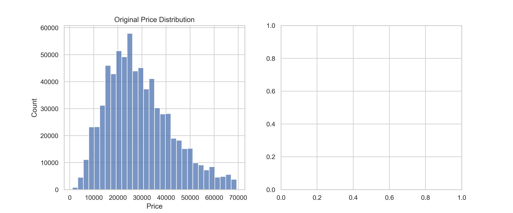
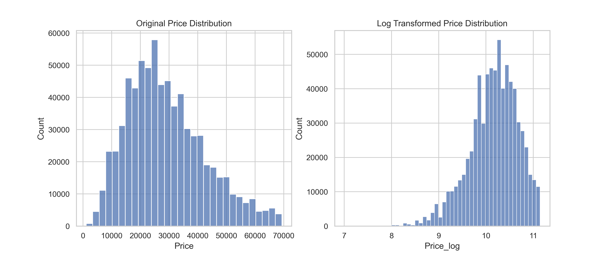

## Used Car Price Prediction
### Business Problem

Predict the resale price of used cars based on vehicle specifications, usage, and seller information.

#### Objective

Identify key factors affecting car prices

Clean and preprocess raw data

Prepare dataset for machine learning models

#### Data Overview

Dataset:
Due to size limitations, the full dataset is not included.
I have used the sample of the dataset.

~762K records, 20 features

Contains numerical, categorical, and binary features

Some features have missing values: e.g., mpg (18.6%), seller_rating (28%), price_drop (46%)

### Data Cleaning
#### Duplicates & Missing Values
* Removed duplicates (~1.2% of data)

* Filled missing numerical features with median

* Filled missing categorical features with mode

* Cleaned high-cardinality categorical columns (Manufacturer, Model, Transmission, Drivetrain, Fuel Type) by keeping top categories and mapping others to 'Other'.

* Extracted numeric features from Engine (Engine_Size) and MPG (Mpg_Clean).

### Exploratory Data Analysis
#### Target Variable Analysis: Price

* Original Price highly right-skewed (skew ≈ 613) with extreme outliers.
* Extreme values were removed using IQR method; prices filtered between $1k–$69k.
* Applied log transformation (Price_log) to reduce skewness and stabilize variance.
* Log-transformed price distribution is now more symmetric, suitable for modeling.

#### Categorical Features
* Analyzed key categorical features: Manufacturer, Fuel Type, Transmission_clean, and Drivetrain using count plots and bar plots.
* Focused on top categories to avoid clutter and improve readability.

#### Numerical Features

* Distribution & outliers explored for:
['Mileage','Vehicle_Age','Mileage_per_Year','Mpg_Clean','Engine_Size','Driver_Reviews_Num']

* Log-transformed skewed features:
* Vehicle_Age_log, Mileage_per_Year_log, Driver_Reviews_Num_log

#### Categorical feature vs price
#### Brand Price Comparison

Count and average price plots for:
['Manufacturer','Fuel Type','Transmission_clean','Drivetrain']

* Automatic, Hybrid, electric, and diesel vehicles tend to have higher prices.
* Ford and Toyota dominate dataset.

#### Correlations

**Strongest negative correlations with price**: Mileage (-0.66), Vehicle_Age (-0.54)

**Positive correlation*: One Owner (0.33)

#### Feature Engineering & Feature Transformation

* Vehicle_Age = Current year - Year
* Mileage_per_Year = Mileage / Vehicle_Age

* Dropped unnecessary columns (Year, Transmission, Engine, Mpg, Price Drop)
* Applied log transformation to right-skewed features:
* Vehicle_Age, Mileage_per_Year, Driver_Reviews_Num

**Feature Summary**
* **Strong predictors**: Mileage, Vehicle Age, Driver Reviews, Mileage per Year.

* **Weak predictors** : Most other features except One Owner.

Final dataset includes cleaned, log-transformed numeric and categorical features ready for modeling.

#### Model Training Pipeline
##### Preprocessing & Splitting

Categorical columns:
['Manufacturer','Model','Drivetrain','Fuel Type','Transmission_clean']

* Train-test split applied.

##### Model Pipelines

* CatBoost Regressor (handles categorical features well)

* LightGBM Regressor (fast and efficient for large datasets)

##### Model Evaluation
#### Initial Model Training (Full Dataset)
On the original dataset, the models achieved the following results:

- **CatBoost**
  - R² Score: ~0.70
- **LightGBM**
  - R² Score: ~0.75

#### Training with Sample Dataset (50,000 Records)
To improve training efficiency and experiment with scalability, a sampled dataset of 50,000 records was used.

#### Cross-Validation Results (5-Fold CV)

To ensure model robustness and reduce variance due to a single train-test split, 5-fold cross-validation was applied.

#### LightGBM:
- Mean R² Score: **0.83**
- Std Dev: Low variance across folds

#### CatBoost:
- Mean R² Score: **0.79**
- Std Dev: Consistent performance across folds

#### Normal Split(Test data)

After preprocessing improvements, feature engineering, and cross-validation tuning, the final models achieved the following performance on the test set:

#### CatBoost
- R² Score: **0.79**
- MAE: **4367.03**
- MSE: **38129394.43**
- RMSE: **6174.90**

#### LightGBM
- R² Score: **0.83**
- MAE: **3852.82**
- MSE: **31336421.94**
- RMSE: **5597.89**
##### Metrics: R², MAE, MSE, RMSE

#### Key Insights

- LightGBM consistently outperformed CatBoost in terms of R² score.
- Cross-validation improved reliability and showed higher generalization performance compared to a single split.
- Increasing dataset size (to 50,000 records) significantly improved model stability and accuracy.
- LightGBM achieved the best overall performance with **R² ≈ 0.83 after cross-validation**.

## Model Saving

- Best model: LightGBM  
- Saved using Joblib for deployment

##### Key Insights

* Mileage and vehicle age are strongest predictors of price.

* Cars with one owner retain higher resale value.

* Fuel type and transmission also influence price.

Best model automatically selected and saved using Joblib

#### ML Pipeline

1. Data preprocessing
2. Feature engineering
3. Train-test split (80/20)
4. Cross-validation
5. Model training
6. Evaluation
7. Best model selection
8. Model saving
9. Model deployment using Streamlit

#### Deployment (Streamlit App)

Built an interactive web app for real-time predictions.

#### User Inputs:
* Manufacturer
* Model
* Mileage
* Fuel Type
* Engine Size

#### Output:
Predicted car resale price

#### Tech Stack
* Python
* Pandas, NumPy
* Scikit-learn
* LightGBM, CatBoost
* Matplotlib, Seaborn
* Streamlit
* Joblib

#### Project Structure
UsedCarPricePrediction/
│
├── data/
│   ├── cars_cleaned.csv
│   └── cars_model.csv
│
├── models/
│   ├── LightGBM_best_model.pkl
│   ├── feature_cols.pkl
│   └── categorical_cols.pkl
│
├── src/
│   ├── preprocessing.py
│   ├── modeling.py
│   └── utils.py
│
├── app.py
├── main.py
└── README.md

#### Key Takeaways

* Mileage and vehicle age are the strongest predictors of price

* Feature engineering significantly improved model performance

* Gradient boosting models performed best on structured data

* End-to-end pipeline ensures reproducibility and scalability

#### Future Improvements

Add model explainability (SHAP)

Hyperparameter tuning

Enhance UI for better user experience

### Steps to execute:
1.Clone the repository
git clone https://github.com/nbisoyi3024/used-car-price-prediction.git
cd used-car-price-prediction
2. Install dependencies
pip install -r requirements.txt
3. Load the Trained Model
models/LightGBM_best_model.pkl
4. python main.py 
5. streamlit run app.py

Niharika Bisoyi
ML Enthusiast
